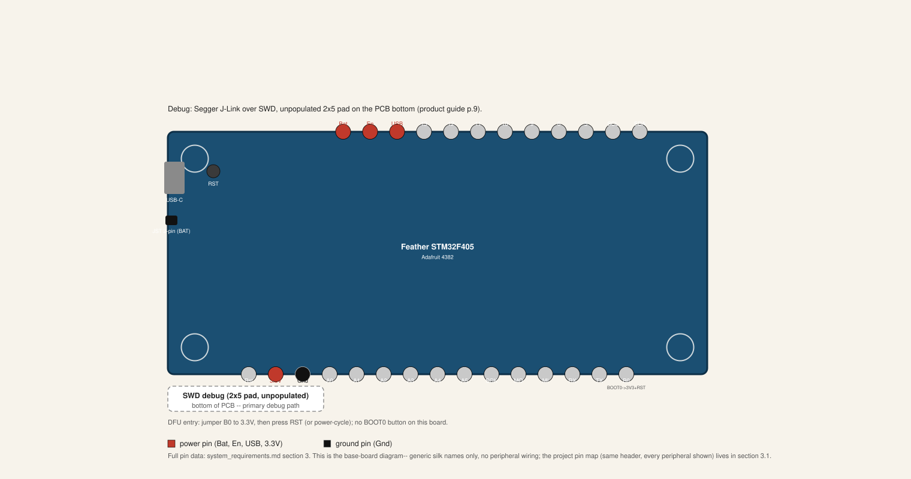

# Adafruit Feather STM32F405

**Status: active workspace member.**  The Adafruit Feather STM32F405
Express is the framework's flagship board (Tier 2: connected device
with TLS/MQTT).  DHCP, SNTP, TLS 1.3, and MQTT v5 QoS-1 telemetry
from a SEN66 sensor are all verified on hardware.  The pin map lives
in [System Requirements, section 3](../system_requirements.md); this
page owns the board-specific hardware summary and the build, flash,
debug, and configuration detail.

## Hardware

Adafruit Feather STM32F405 (STM32F405RG, Cortex-M4F @ 168 MHz,
1 MB flash, 192 KB SRAM) with a W5500 Ethernet module and a
Sensirion SEN66 environmental sensor (PM, CO2, VOC, NOx,
temperature, humidity) over I2C.  Debug probe: Segger J-Link over
SWD.

## Pinout

This is the base-board diagram: generic header names, the debug hookup
(SWD, unpopulated 2x5 pad), and the DFU entry point only-- no peripheral
wiring.  The full pin map, with every peripheral's wiring and which of
them firmware actually drives today, replaces the ASCII diagram in
[System Requirements, section 3](../system_requirements.md), which wins
on any disagreement.



## What It Does

An RTIC 2.x application that reads the SEN66 over I2C and publishes
telemetry over MQTT v5 (QoS-1) with TLS 1.3, using DHCP for
addressing and SNTP for time sync.  See `AGENTS.md` for the module
map.

## Building

```sh
choom -n 1000 -- cargo build --release -p feather-stm32f405 \
  --target thumbv7em-none-eabihf
```

Building alone does not flash the board.  See Flash Only below to
flash an already-built binary, or Debugging for `cargo embed`, which
builds, flashes, and streams logs in one step.

## Flash Only

```bash
# Flash the release build
cargo flash --release --chip STM32F405RGTx
```

## Debugging

### View Logs with RTT

The firmware uses `defmt` for efficient logging over RTT (Real-Time
Transfer):

```bash
# Build, flash, and view logs
cargo embed --release

# Or just attach to an already-running device
probe-rs attach --chip STM32F405RGTx
```

### Interactive Debugging with probe-rs

```bash
# Start GDB server
probe-rs gdb --chip STM32F405RGTx target/thumbv7em-none-eabihf/release/feather-stm32f405

# In another terminal, connect with GDB
# (Requires arm-none-eabi-gdb or gdb-multiarch installed separately)
arm-none-eabi-gdb target/thumbv7em-none-eabihf/release/feather-stm32f405
(gdb) target remote :1337
(gdb) continue
```

## Network Configuration

Edit `boards/feather-stm32f405/src/config.rs` for:

- MQTT broker settings
- TLS certificates
- Network timeouts

## Alternative Flashing Methods

If you don't have a debug probe, the Feather STM32F405 has a built-in
DFU bootloader:

1. **Enter DFU mode:**
   - Press and hold BOOT0 button
   - Press and release RESET button
   - Release BOOT0 button

2. **Flash via DFU** (requires dfu-util installed separately):
   ```bash
   cargo build --release --target thumbv7em-none-eabihf
   # Then use dfu-util (installation varies by OS)
   ```

**Note:** probe-rs is the recommended workflow.  DFU mode is a
fallback for boards without debug probe access.

## Testing

On-device bring-up tests use `embedded-test` (`mise run
test:device`); smoke and integration suites run via `mise run
test:smoke` and `mise run test:integration` (tiered `-extended` /
`-full` variants exist for both).  See
[`testing.md`](../development/testing.md) for detail.
