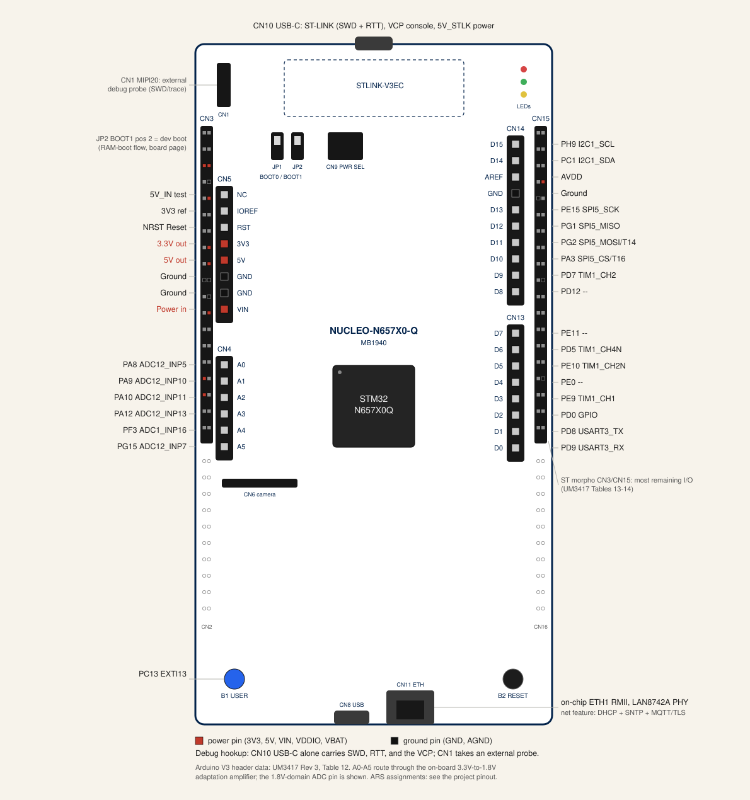

# ST NUCLEO-N657X0-Q-- ARS Toolhead Sensor

**Status: bring-up spike in progress.**  Gate G0's RAM-boot half
passed on the bench 2026-07-21: the `g1-spike` image builds, loads
over SWD, and boots from AXISRAM with a defmt log line decoded over
RTT (see [Bring-Up: RAM-Boot Dev Flow](#bring-up-ram-boot-dev-flow)
below).  The default feature set remains a deliberate
`compile_error!` scaffold guard, the external-NOR boot chain via a
signed first-stage boot loader (FSBL) is still unverified, and the
crate stays workspace-excluded.

Planned target: `thumbv8m.main-none-eabihf` (Cortex-M55; rustc
has no thumbv8.1m triple-- Helium/MVE selects via target-cpu).

## Why Workspace-Excluded

Per the `boards/` rule
([`boards/AGENTS.md`](../../../boards/AGENTS.md)), new profiles stay
in the root `[workspace]` exclude list until they compile in CI
(target installed, clippy clean).  This crate additionally gates on
the bring-up spike: the flow for the flashless external-NOR boot
chain via a signed FSBL is unverified.  The `g1-spike` feature pins
the dependency stack and is the G0 RAM-boot image.

## Bring-Up: RAM-Boot Dev Flow

**Status: bench-verified 2026-07-21** for the RAM-boot half of gate
G0.  The N6 is flashless; this flow loads and runs an image entirely
from AXISRAM over SWD.  The external-NOR/FSBL boot chain is a
separate, still-unverified flow.

Board precondition: JP2 (BOOT1) in position 2 (logical 1, dev
boot)-- the boot ROM only exposes a debug-friendly state in dev
boot, and BOOT pins latch at reset, so power-cycle after moving the
jumper.  In flash-boot position the debug port enumerates but
reports no access ports.

1. Build: `cargo build --features g1-spike` in the crate directory
   (`thumbv8m.main-none-eabihf`).
2. Reset: before loading, put the core through a genuine system
   reset (SYSRESETREQ over the debug port; fall back to an NRST
   pulse if the debug port itself is unresponsive)-- never skip
   this and never substitute a fresh debugger reconnect for it.
   Confirm the reset actually landed (the exception-active state
   reads clear) before proceeding.  This step is load-bearing, not
   defensive housekeeping: a load attempt that failed or was
   interrupted on this chip can leave the core halted inside an
   active exception handler, and that state survives a plain
   reconnect.  An image then loaded on top of it runs at negative
   execution priority-- every configurable-priority interrupt shows
   enabled and pending in the NVIC but is never taken, silently,
   with no fault reported (bench finding, phase-1 dispatch bring-up,
   2026-07-21).  Debug-register-level recovery does not work around
   it: the registers that hold exception-active state either ignore
   debugger writes outright or require an already-halted core, and
   a typical attach sequence resumes the core before such a write
   would land.  Only a real reset clears it, so treat any load that
   "looked wedged" as a hard signal to reset before retrying rather
   than just reconnecting.
3. Load: `STM32_Programmer_CLI -c port=SWD mode=HOTPLUG -halt -w
   <image>.elf --verify` (8 MHz SWD; the CLI requires a `.elf` file
   extension).
4. Start: read initial SP and entry from the ELF (vector table base
   `0x341A0000`), then `-coreReg MSP=<vector0> PC=<entry> -run`.
   Do not use `-s`: it soft-resets the chip, which re-enters the
   boot ROM's dev-boot wait loop instead of the loaded image.  This
   is a different reset than step 2's-- step 2 clears leftover
   exception state before the new image is even in RAM; `-s` here
   would instead throw away the image just loaded.
5. Observe: `probe-rs attach --chip STM32N657 --speed 100 <elf>`
   decodes defmt over RTT.

Two toolchain caveats, both bench-reproduced: probe-rs `run`'s load
path wedges the onboard STLINK-V3EC with USB bulk-transfer timeouts
(upstream probe-rs issue; `attach` is unaffected), so the load step
goes through STM32CubeProgrammer CLI (2.21.0+; 2.20.0 has a
flash-erase bug on this board).  And the image must set VTOR
itself-- the boot ROM's vector table stays live otherwise and the
first exception hard-faults into ROM; the crate uses cortex-m-rt's
`set-vtor` feature for this (see the comment in `Cargo.toml`).

The linker script (`memory.x`) reflects the same RAM-only
constraint.  As of probe-rs v0.30.0, which added the STM32N657
target, this chip's target definition ships with no flash
algorithm for its external NOR (XSPI/OCTOSPI)-- the adding PR
describes the chip as having "no internal flash.  Instead the EVK
is shipped with a QSPI flash device."  SWD-loaded RAM execution is
therefore the entire G0 flow, not a fallback from something
better: https://github.com/probe-rs/probe-rs/pull/3436

`memory.x` started from embassy's own working N6 example carve-- a
256K `FLASH` / 128K `RAM` window at the top of AXISRAM2-- rather than
being derived fresh:
https://raw.githubusercontent.com/embassy-rs/embassy/main/examples/stm32n6/memory.x
The `net` feature's MQTT-over-TLS path outgrew that 128K, so the
regions were regrown (a future memory-map change should still
re-check the embassy example first).  TLS 1.3 record buffers (~34 KB)
plus TCP/MQTT buffers, the embassy-net packet ring, and a deep
handshake stack do not fit 128K, and this crate forbids `unsafe`, so
feather's CCM-RAM buffer placement is unavailable-- the buffers live
in ordinary RAM.  The two regions now fill AXISRAM2
(0x34100000-0x34200000), the one bank the boot ROM guarantees enabled
at reset: `FLASH` stays pinned at 0x341A0000 (384K)-- the RAM-boot
loader reads the initial SP/PC from the vector table there, so its
origin must not move-- and `RAM` takes the whole free lower 640K
(0x34100000-0x341A0000), which the embassy example documents as free
app RAM.  RAM sitting below FLASH numerically is fine; flip-link
places `.data`/`.bss` at the RAM top and starts the stack just below
them, growing down toward the region base.  Both regions sit inside
the AXISRAM123456 secure alias
(0x34000000-0x343c0000), not the non-secure alias (0x24000000)-- the
boot ROM's TrustZone state at reset in dev-boot mode (BOOT1=1) is
presumed to require the secure alias.

## embassy-stm32 / stm32-metapac Coverage Gaps

**Status: verified against embassy-stm32 0.6.0 / stm32-metapac 21.0.0,
2026-07-21.**  Three peripherals the ARS toolhead-sensor design needs
have no embassy-stm32 driver support for `stm32n657x0` in this crate's
locked *released* dependency versions: on-chip Ethernet (ETH), ADC1,
and TIM1.  The gaps sit in the release's per-chip peripheral
generation, not in this crate's code-- and, for ETH at least, they
are release lag, not missing upstream work: embassy git main carries
a working N6 Ethernet driver and an `eth_speedtest` example
(`examples/stm32n6`, `ETH1` + station-management `Sma` types, run on
the STM32N6570-DK), built against a newer git `stm32-metapac` than
the 21.0.0 release.  ADC1/TIM1 status on git main is unverified.

### Evidence

- **ETH.**  The N6's `stm32-metapac` `pac.rs` for `stm32n657x0` does
  list an ETH1 peripheral (IRQ 179, base address `0x4803_6000`), but
  the chip's metapac *metadata*-- the data embassy-stm32's build
  script reads to decide which peripherals exist-- carries no ETH
  entry for this chip.  Metadata absence, not `pac.rs` absence, drives
  code generation: embassy-stm32's build script sets none of the
  `eth_v1a`/`eth_v1b`/`eth_v1c`/`eth_v2` `cfg`s for `stm32n657x0`, so
  `embassy_stm32::eth` compiles no driver and no pin-trait
  implementations for this chip.  A peripheral can appear in the
  register map and still be invisible to the HAL if the metadata
  omits it.
- **ADC1 and TIM1.**  Same failure mode, missing register-block
  metadata: `stm32-metapac` 21.0.0 has `registers: None` for both the
  "ADC1" and "ADC12_COMMON" peripheral entries on this chip, and TIM1
  has no peripheral entry at all-- only TIM9, the time driver, is
  generated for `stm32n657x0`.  `embassy_stm32::adc` cannot target
  ADC1 in any mode, not even blocking calibration-only init, and there
  is no PWM API surface to build a carrier against.

### What Each Gap Blocks

- **ETH** blocks on-chip MAC network bring-up *under the pinned
  release*: no Ethernet driver means no IP stack path over the N6's
  own MAC, independent of cabling or PHY state.  See Paths Forward
  for the git-main escape hatch.
- **ADC1 and TIM1** block the phase-1 `capture` and `sweep_engine`
  RTIC tasks.  Both are dormant hardware-task shells in
  [`main.rs`](../../../boards/nucleo-n657x0/src/main.rs) today--
  empty bodies, GPDMA channels claimed but no transfer ever
  configured-- because ADC1 has no addressable register block and
  TIM1 has no singleton to build a PWM carrier against.  Gate G1
  runtime (GPDMA linked-list/circular-capture mode), G2 (mic capture
  quality), and G3 (PWM audio fidelity) in
  [`pinout.md`](../projects/ars-toolhead-sensor/pinout.md) cannot
  start until this lands.

### Paths Forward

- **On-chip ETH:** embassy git main already has the N6 driver (see
  Status above), so the options are tracking git main for
  embassy-stm32 (a dependency-policy decision, since the rest of the
  workspace pins the 0.6.0 release) or waiting for the next
  embassy-stm32 release to carry it.  The gap closes upstream either
  way; no driver work is needed here.
- **ADC1/TIM1** wait on `stm32-metapac` metadata and embassy-stm32
  generation for `stm32n657x0`-- unverified on git main as of
  2026-07-21.  No workaround exists within this crate's rules-- a
  hand-rolled PAC-level driver would need `unsafe`, and
  [`rust_style.md`](../../../.agents/rules/rust_style.md)'s
  unsafe-isolation policy requires explicit user approval before
  adding any new `#![allow(unsafe_code)]` file to this crate.
- **Network, near-term:** an SPI W5500 module via
  `embassy-net-wiznet`-- the pattern already proven on
  `feather-stm32f405`-- is a viable path if a module is wired to the
  N6 morpho SPI pins.  No such module is on the bench today; this is
  an unexplored option, not a plan of record.  `iot-net` stays
  transport-agnostic either way, so adopting W5500 here would not
  require changes to the shared network stack.
- **ADC1/TIM1 has no equivalent workaround.**  Unlike networking,
  there is no off-chip substitute for the mic-capture ADC and
  PWM-carrier timer wired into the ARS signal path (see
  [Pinout](#pinout) below), so this half of the gap stays fully
  blocked on upstream embassy-stm32 support.

## Pinout

This is the base-board diagram: the full Arduino Uno V3 header
pinout (UM3417 Rev 3, Table 12) plus the debug hookup, drawn to
match the MB1940 board layout (top overlay, MB1940 schematic
p.19).  Project-specific assignments are deliberately absent;
the ARS hookup diagram lives with the project pin map in
[`pinout.md`](../projects/ars-toolhead-sensor/pinout.md), which
wins on any disagreement.

Notes:

- Debug: CN10 USB-C alone carries SWD, RTT, and the VCP console
  (PE5/PE6, USART1-- reserved pins, reachable only through the
  STLINK-V3EC).  CN1 is a MIPI20 header for an external probe.  JP2
  BOOT1 in position 2 selects dev boot; see the RAM-boot flow
  above.
- A0-A5 each route both a 3.3 V digital pin and a 1.8 V ADC pin
  through an on-board voltage-adaptation amplifier (UM3417 Figure
  14); the diagram shows the ADC-side MCU pin, since the N6 ADC
  lives in the 1.8 V VDDA domain.  A4/A5 can alternatively carry
  I2C1 (PC1/PH9), but only with solder-bridge changes (SB2/SB4
  ON, SB3/SB5 OFF); D15/D14 expose the same I2C1 pins with no
  bridges.
- The ST morpho headers CN3/CN15 carry per-row pin names on the
  diagram (odd/even, UM3417 Table 13), matching the board's own
  silk.  The unfitted CN2/CN16 footprints below them are drawn but
  not named; see UM3417 Table 14.

Authoritative source:
[`pinout.md`](../projects/ars-toolhead-sensor/pinout.md)-- read it
for the full rationale, decisions, open questions, and gate criteria
behind every ARS assignment above.

## HIL Bench: Saleae Probe Hookup

The plan below covers the ARS toolhead sensor's five ARS signals
plus two bring-up aids, probed with the Logic MSO 2x100 (2 analog
channels, 8 digital channels, expandable to 20).  General MSO
operation-- the 1.65 V digital-threshold rule for 3.3 V logic,
grounding practice, and trigger-type explanations-- lives in the
[Saleae Logic skill](../../../.agents/skills/saleae-logic/SKILL.md);
this page states only what is specific to this board.
[`pinout.md`](../projects/ars-toolhead-sensor/pinout.md) wins on
every pin identity below; this page decides no pin assignments of
its own.

All six probed digital signals sit on the 3.3 V header domain, so
every digital channel uses the 1.65 V threshold preset.  The debug
console is not a probe point: USART1 VCP (PE5/PE6) is internal to
the STLINK-V3EC and reachable only over the CN10 USB connector, so
console liveness is watched over USB, never captured on a digital
channel.

### Digital channel plan

| Channel | Signal | Purpose |
|---|---|---|
| D0 | AMP_I2C_SCL (PH9, morpho CN15 pin 3) | I2C1 clock to the MAX9744; pair with D1 to decode volume and mute register writes. |
| D1 | AMP_I2C_SDA (PC1, morpho CN15 pin 5) | I2C1 data to the MAX9744 at address 0x4B; see `pinout.md` for bus rationale. |
| D2 | AUDIO_PWM (PE9, Arduino D3, also morpho CN15 pin 31) | TIM1_CH1 PWM carrier into the RC low-pass ahead of the MAX9744 line input; a gate G3 fidelity input. |
| D3 | AMP_MUTE_N (PD0, Arduino D2, also morpho CN15 pin 33) | Mute control into the amp's inverting stage-- drive LOW to mute; rising edge marks unmute/sweep start. |
| D4 | USER_BTN (PC13, morpho CN3 pin 23) | On-board blue user button; bring-up interaction and EXTI-path liveness. |
| D5 | NRST | Board reset; anchors bring-up captures to power-on/warm-reset timing. |

D6 and D7 are free in the 8-channel base kit; the digital channel
count expands to 20 across up to 5 probe cables
(`logic_mso_user_manual.pdf`, Digital Measurements) if a later spike
adds signals of interest.

### Analog channel plan

| Channel | Signal | Purpose |
|---|---|---|
| Analog 1 | MIC_AUD, Arduino A0 (CN4 pin 1), 3.3 V header side | Mic capture ahead of the on-board 3.3 V-to-1.8 V adaptation amplifier; probe the 3.3 V header pin, never the 1.8 V ADC-side pin-- the mic's ~1.65 V bias lives on the 3.3 V side.  A gate G2 input. |
| Analog 2 | Audio line after the external RC low-pass, MAX9744 LEFTIN (JP2 pin 2)-- or moved to raw PE9 to inspect the 200 kHz PWM carrier directly | Gate G3 SNR/THD comparison between the filtered line signal and, when moved, the raw carrier. |

### Trigger points

An edge trigger on AMP_MUTE_N's rising edge (unmute, marking sweep
start) or on I2C1's first start bit (the volume command to the
MAX9744 at 0x4B) anchors an audio-path capture to the start of a
measurement window.  Bring-up captures trigger on USER_BTN or NRST
instead.  (Trigger types-- Edge, Pulse, Slope-- are explained in the
skill linked above.)

### Verification status

Hardware has been on the bench since 2026-07-20, but no probe is
attached yet and Logic 2 is not installed on the bench machine.
Treat every channel assignment above as unverified until it runs
against the board and is confirmed in the Logic 2 UI.  Gate G2/G3
pass/fail measurement specs-- not channel assignments-- live in
[HIL measurements](../projects/ars-toolhead-sensor/hil-measurements.md).

## Where the Real Content Lives

- Project docs:
  [`docs/src/projects/ars-toolhead-sensor/`](../projects/ars-toolhead-sensor/README.md)
- Decision record: ADR-010 in
  [`decisions.md`](../architecture/decisions.md)
