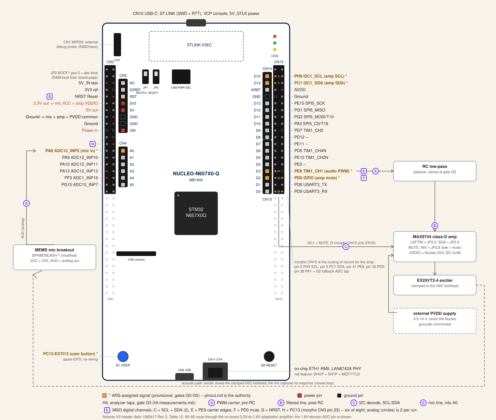

# ARS Toolhead Sensor-- Pinout

This is the provisional pin map of record for the NUCLEO-N657X0-Q
ARS toolhead sensor node.  It was decided from UM3417 (Nucleo
board user manual), the STM32N657X0 datasheet (DS14791), RM0486
(reference manual), and the analog-chain survey documents covering
the SparkFun MEMS mic breakout and the Adafruit MAX9744 amplifier
board.  Nothing here has been bench-verified; see Spike Gates
below for what must pass before the map is final.

The hookup diagram below draws this map onto the MB1940 board
layout: highlighted pins are the ARS assignments, the external
boxes are the audio chain, and the circled taps are the gate G3
analyzer connections from
[`hil-measurements.md`](./hil-measurements.md).  The [Pin
Map](#pin-map) table remains the authority on every disagreement;
the base-board diagram (debug hookup only, no project wiring)
lives on the [board page](../../boards/nucleo-n657x0.md).

## Pin Map

| Signal | MCU Pin | AF | Peripheral | Nucleo Connector | Notes |
|--------|---------|-----|-----------|-------------------|-------|
| MIC_AUD (mic analog in) | PA8 | analog (GPIO analog mode, no AF index) | ADC1_INP5 (dual-mode ADC12_INP5), GPDMA1 REQSEL 7 (adc1_dma), linked-list circular capture | Arduino CN4 pin 1 (A0), via on-board 3V3-to-1V8 adaptation amplifier | Firmware must hold PF5 (the paired 3.3 V digital A0 pin) in analog/Hi-Z to avoid contention. |
| AUDIO_PWM (sweep out) | PE9 | AF1 | TIM1_CH1, duty stream via GPDMA1 REQSEL 18 (tim1_upd_dma) | Arduino CN13 pin 4 (D3); also morpho CN15 pin 31.  External RC low-pass into MAX9744 JP2 pin 2 (LEFTIN) | Single-ended PWM only; CH1N/dead-time unused, PE8 stays free. |
| AMP_I2C_SCL (MAX9744 volume) | PH9 | AF4 | I2C1 (Fm+), interrupt-driven event/error | Morpho CN15 pin 3 (direct).  Arduino D15/A5 only with SB2/SB4 ON + SB3/SB5 OFF | Private bus: PE5/PE6 (I2C1's usual survey pins) are the VCP, I2C2 is the USB-PD/camera bus. |
| AMP_I2C_SDA (MAX9744 volume) | PC1 | AF4 | I2C1 (Fm+), interrupt-driven event/error | Morpho CN15 pin 5 (direct).  Arduino D14/A4 only with SB2/SB4 ON + SB3/SB5 OFF | Wire to MAX9744 JP2 pin 4 (SDA); level shifting and pull-ups live on the amp board. |
| AMP_MUTE_N (drive LOW to mute) | PD0 | none (GPIO output, open-drain recommended) | GPIO | Arduino CN13 pin 3 (D2); also morpho CN15 pin 33.  Wire to MAX9744 JP2 pin 8 (MUTE_INV) | Adafruit board inverts MUTE: drive LOW to engage mute (opposite the bare chip datasheet). |
| USER_BTN (spare EXTI) | PC13 | none (GPIO input, EXTI13) | EXTI | On-board blue user button B1; also morpho CN3 pin 23 | Zero external wiring; bring-up interaction and EXTI-path verification. |
| VCP_TX (debug console out) | PE5 | AF7 | USART1_TX | Internal to STLINK-V3EC, exposed as VCP on CN10 USB | Reserved: hardwired to the VCP, never available for I2C1/TIM. |
| VCP_RX (debug console in) | PE6 | AF7 | USART1_RX | Internal to STLINK-V3EC, exposed as VCP on CN10 USB | Reserved: paired with VCP_TX. |

## Rationale

### MIC_AUD (PA8)

Arduino A0 routes through the Nucleo's on-board amplifier that
scales 3.3 V analog down to the 1.8 V ADC pin PA8 (UM3417 Rev 3,
note and Figure 14, p.29; Table 12, p.30).  This keeps the mic
breakout's AUD output-- biased at VCC/2, ~1.65 V on a 3.3 V rail
(SparkFun schematic R1/R2 divider; analog survey)-- inside the
ADC's VSSA..VDDA18ADC ~1.8 V limit (DS14791 Rev 9, Table 94 note
2, p.200) with zero external parts.  PA8 = ADC1_INP5/ADC2_INP5
(DS14791 Table 18).  GPDMA1 adc1_dma is hardware request REQSEL 7
with linked-list support (RM0486 Rev 4, Table 98, p.932; sect.
19.4.5).  Conflict check: PA8 appears on no Nucleo on-board
function table (Ethernet Table 10, USB Table 9, camera CN6, LEDs).
The mic side needs no digital pins at all (analog survey).

### AUDIO_PWM (PE9)

The N657 has no on-chip DAC-- an exhaustive search of RM0486 Rev
4's table of contents finds no DAC chapter (MCU survey, RM0486 Rev
4 ToC)-- so audio out is advanced-timer PWM.  PE9 = TIM1_CH1 AF1
(DS14791 AF table, row PE9), exposed on Arduino D3 (UM3417 Table
12, p.30).  At the 200 MHz timer kernel clock (DS14791 Table 109)
a 200 kHz carrier gives ~1000 steps, ~10-bit resolution
(survey-derived).  GPDMA1 tim1_upd_dma REQSEL 18 streams CCR1
updates (RM0486 Table 98).  The MAX9744 input is single-ended,
line-level up to 3 Vpp, with on-board 20 kOhm gain resistors and
0.47 uF AC coupling (MAX9744.pdf pp.11-12; Adafruit schematic
R6-R9/C22-C23; README), so a single-ended RC-filtered PWM line
suffices; complementary CH1N and dead-time are unnecessary, leaving
PE8 free.  Conflict check: PE9 is absent from all Nucleo on-board
function tables.

### AMP_I2C_SCL (PH9) and AMP_I2C_SDA (PC1)

The survey's preferred I2C1 pins PE5/PE6 are hardwired to the
ST-LINK VCP (UM3417 Rev 3, sect. 7.9, p.24) and I2C2 PB10/PB11 is
committed to the on-board USB-PD controller and camera connector
(UM3417 Table 9, p.25; camera CN6 table), so the amp gets a
private I2C1 bus.  PH9 = I2C1_SCL AF4 and PC1 = I2C1_SDA AF4
(DS14791 AF table; MCU survey).  Morpho CN15 pins 3 and 5 are
direct connections (UM3417 Table 13, p.32) and neither pin is in
the disconnected-by-default list (Table 14 note 1), so no
solder-bridge change is needed; the Arduino-header route instead
requires SB2/SB4 ON + SB3/SB5 OFF and sacrifices A4/A5 analog
(Table 12 note 2, p.30).  Bus pull-ups already exist on the amp
board's BSS138 level shifter (10 kOhm both sides, Adafruit
schematic R1/R3/R4/R5); tie amp JP2 pin 6 VDDIO to Nucleo 3V3.
MAX9744 default address 0x4B (ADDR1/ADDR2 pulled high, SJ3/SJ4
open; MAX9744.pdf Table 4, p.17; Adafruit schematic), VIH = 0.7 x
3.3 V = 2.31 V satisfied by 3.3 V MCU levels (MAX9744.pdf p.4).

### AMP_MUTE_N (PD0)

The Adafruit board inverts MUTE: header net MUTE_INV drives Q4,
which pulls the chip's MUTE pin; on-board 10 kOhm R15 keeps
MUTE_INV high (= not muted) by default, and the MCU must drive the
header pin LOW to engage mute (Adafruit schematic Q4/R14/R15;
MAX9744.pdf p.11, pin 24)-- the opposite sense of the bare chip
datasheet.  One GPIO is warranted so sweeps can be silenced during
capture-only windows and faults; SHDN stays unconnected (see
Decisions).  PD0 has no on-board Nucleo function (absent from
Tables 9/10, LED and button sections) and its AFs (TIM1_ETR,
FDCAN1_RX; DS14791 AF table, row PD0) are unused here.  Open-drain
is recommended because the surveyed facts do not identify which
rail R15 pulls to.

### USER_BTN (PC13)

The one spare EXTI comes free: B1 is wired to PC13 with
wake-up/tamper support (UM3417 Rev 3, User button section, p.23;
morpho Table 13, p.32).  Zero external wiring; used for bring-up
interaction and EXTI-path verification, mirroring the feather
board's counting-EXTI telemetry style
(`boards/feather-stm32f405/src/counting_exti.rs`).

### VCP_TX / VCP_RX (PE5 / PE6)

USART1 on PE5/PE6 is hardwired to the STLINK-V3EC VCP at
115200-8N1 (UM3417 Rev 3, sect. 7.9, p.24).  PE5 = USART1_TX AF7
(also the boot USART pin) and PE6 = USART1_RX AF7 (DS14791 AF/pin
tables).  Reserved: these two pins are never available for I2C1 or
TIM despite their AF options.  Primary logging remains defmt over
RTT via SWD (STLINK-V3EC supports SWD, UM3417 sect. 7.x, p.16) at
zero GPIO cost, per house style; the VCP is the secondary human
console.

## Decisions

1. Audio-out path is TIM1_CH1 PWM (PE9) plus an external RC
   low-pass into the MAX9744 line input, provisional and
   spike-gated.  The STM32N657 has no on-chip DAC (RM0486 Rev 4
   ToC has no DAC chapter; MCU survey).  PWM gives ~10-bit
   resolution at a 200 kHz carrier from the 200 MHz timer kernel
   clock; the fallback is SAI1 plus an external I2S DAC, decided
   at gate G3 (phases 1-3).  Complementary/dead-time outputs are
   not used-- the amp input is a single-ended line-level signal,
   not a power bridge.
2. Mic input is PA8/ADC1_INP5 via Arduino A0, deliberately using
   the Nucleo's on-board 3.3 V-to-1.8 V analog adaptation amplifier
   (UM3417 Figure 14, p.29) instead of an external divider.
   Fallback: PA1/ADC1_INP1 on morpho CN15 pin 38-- the only raw
   survey-listed ADC pin exposed on any connector after Ethernet
   (Port F) and camera/USB (PA0, PB11) exclusions-- with an
   external scale/bias network into the 1.8 V domain (gate G2).
3. Amp control bus is I2C1 on PH9/PC1 at morpho CN15 pins 3/5: no
   solder-bridge change required.  PE5/PE6 (VCP) and PB10/PB11
   (USB-PD controller plus camera bus) are excluded.  If a future
   Arduino shield needs the D14/D15/A4/A5 I2C position, set
   SB2/SB4 ON and SB3/SB5 OFF (UM3417 Table 12 note 2, p.30),
   losing A4/A5 analog.
4. Amp utility GPIO budget: one pin only.  MUTE via PD0
   (open-drain, drive low to mute through the board's inverting
   Q4 stage).  SHDN is left unconnected-- the amp board's R12
   pull-up defaults it to normal operation (Adafruit schematic)--
   and ADDR1/ADDR2 straps stay untouched, selecting I2C mode at
   0x4B.  The second utility slot is the on-board PC13 user
   button as spare EXTI, costing no wiring.
5. Power: MAX9744 PVDD comes from a dedicated external 4.5-14 V
   supply, never the Nucleo.  UM3417 budgets: 3V3 rail up to
   300 mA (Figure 9, p.19), 5V_STLK 500 mA, VIN input capability
   max 800 mA at 7 V falling to 250 mA at 12 V (Table 6, p.20)--
   all far below a 20 W / 4 ohm class-D load.  Mic breakout VCC
   and the amp's VDDIO level-shifter reference both tie to Nucleo
   3V3 (mic normal-mode Vdd 2.3-3.6 V and OPA344/345 2.5-5.5 V
   both satisfied; analog survey).  Grounds commoned; AGND
   strategy goes to EE review.
6. Every peripheral is interrupt/DMA-driven per the framework:
   capture uses a GPDMA1 channel with adc1_dma REQSEL 7 in
   linked-list circular mode (RM0486 Table 98, sect. 19.4.5), IRQ
   wakes the RTIC capture task; sweep_engine uses a GPDMA1 channel
   with tim1_upd_dma REQSEL 18 feeding CCR1; telemetry/volume use
   I2C1 event/error interrupts; EXTI13 serves the button; idle
   does WFI.  This matches the feather house style (RTIC
   `#[app(device = embassy_stm32, peripherals = true, dispatchers
   = [...])]`, `bind_interrupts!`, WFI idle loop in
   `boards/feather-stm32f405/src/main.rs`).
7. Debug/egress story: defmt-RTT over SWD (STLINK-V3EC) is the
   primary log channel per house style; USART1 VCP on PE5/PE6 is
   the secondary console, and those pins are permanently reserved
   in the map so no later peripheral claims their I2C1/TIM AFs.

## Open Questions (EE Review)

- Transfer function of the Nucleo's A0-A5 adaptation amplifier
  (gain/attenuation ratio, bandwidth, input impedance, output
  offset) is not specified in UM3417-- only the topology (Figure
  14, p.29).  Audio-band flatness to ~20 kHz is unverified; needs
  the MB1940 schematics (UM3417 sect. 4 says design files are on
  st.com) and a bench check.
- The modified mic breakout (OPA345NA swap plus 30 kOhm replacing
  C3) has unknown actual gain, bandwidth, and DC operating point--
  `hardware.md` records the mod as given, and the ~5.8x figure is
  survey inference from schematic analysis, not measurement.
  Characterize before fixing ADC scaling and sweep analysis
  calibration.
- Which rail pulls up the amp header's MUTE_INV net (R15) is not
  identified in the surveyed facts (3.3 V vs the 5 V-side
  diode-shifted domain).  Confirm open-drain PD0 is sufficient,
  and whether power-up pop behavior justifies also wiring SHDN
  after all.
- Physical state of SJ3/SJ4 on the amp board in hand: the 0x4B
  I2C address assumes both jumpers open (schematic default).
  Verify on the physical unit before hardcoding the address.
- Grounding: the Nucleo exposes AGND (morpho CN15 pin 32) and
  VREFP (CN15 pin 7); the amp board has AGND (JP2 pin 3) with its
  SJ1 local tie.  Single-point grounding plan between the Nucleo,
  mic, amp, and the external PVDD supply needs EE review.
- ADC reference configuration: VREFBUF options (1.21 V / 1.5 V)
  vs VDDA18ADC-derived VREF+ (DS14791 sect. 3.22) set the
  effective full scale seen through the adaptation amp-- decide
  before calibrating the mic chain.  Whether VREF+ can exceed
  VDDA18ADC limits was left uninvestigated by the MCU survey.
- Whether Arduino D14/D15 (CN14 pins 9/10) carry PC1/PH9
  independently of SB2-SB5 is ambiguous in the UM3417 text;
  irrelevant to the morpho routing chosen, but matters if a shield
  is ever stacked.
- External amp supply sizing (voltage within 4.5-14 V, current for
  20 W / 4 ohm sweeps) is not derivable from the cited documents
  alone; EE to specify.
- Exciter usable frequency range and Xmax are explicitly N/A in
  Dayton's spec sheet-- firmware sweep bounds (provisionally ~Fs
  105 Hz up to the 20 kHz chart edge) are bench-characterization
  inputs, not vendor guarantees.

## Spike Gates

What phases 1-3 must confirm before this map is final:

- **G0** (pre-phase-1, blocks everything).  probe-rs flow for the
  flashless external-NOR boot chain via a signed first-stage boot loader (FSBL)
  works on the NUCLEO-N657X0-Q.  The `nucleo-n657x0` crate stays
  workspace-excluded with `compile_error!` until this passes
  (`boards/nucleo-n657x0/README.md` and `AGENTS.md`).
- **G1** (phases 1-2).  embassy-stm32 feature `stm32n657x0`
  actually covers ADC plus GPDMA linked-list/circular capture, TIM1 PWM
  with DMA duty update, I2C1, and EXTI under RTIC 2 with the
  thumbv8main backend on the Cortex-M55.  Compile half CLOSED
  2026-07-19: embassy-stm32 0.6.0 (0.4 has no N6 features; support
  starts at 0.5) with `time-driver-tim9` (TIM9 is the only usable
  time-driver timer on this chip in 0.6.0) plus rtic 2.2.0
  `thumbv8main-backend` and rtic-monotonics `cortex-m-systick` (no
  N6 chip feature exists upstream) compiles cleanly for
  `thumbv8m.main-none-eabihf`-- see the `g1-spike` feature in
  `boards/nucleo-n657x0/Cargo.toml`.  Runtime half still open.
  Fallback: PAC-level drivers behind the same RTIC task API.  Also
  confirm whether GPDMA offers a true circular/ping-pong linked-list
  mode-- the survey verified only the section headings (RM0486 sect.
  19.4.5, 19.4.7-19.4.9), not their contents.
- **G2** (phases 1-2).  A0 adaptation-amplifier capture quality-- noise
  floor, flatness across the sweep band, and headroom with the mic's
  ~1.65 V bias.  Overturn criterion: if the on-board stage degrades the
  audio band, switch MIC_AUD to PA1 (raw ADC1_INP1, morpho CN15 pin 38)
  with an external divider/bias network into the 1.8 V domain; the pin
  map row changes but nothing else does.
- **G3** (phases 1-3).  PWM-audio fidelity-- SNR/THD of TIM1_CH1 plus
  RC filter into the MAX9744, measured against sweep-analysis
  requirements, given the ~10-bit ceiling at a 200 kHz carrier.
  Overturn criterion: inadequate fidelity flips the audio path to SAI1
  plus an external I2S DAC (SAI presence confirmed: 2 instances,
  DS14791 Table 5), which triggers a pin-map revision for the SAI pin
  set.
- **G4** (phases 1-2).  I2C bus scan finds the MAX9744 at 0x4B with the
  level shifter referenced to Nucleo 3V3.  If absent, inspect SJ3/SJ4
  and re-strap before touching firmware constants.
- **G5** (phase 3).  End-to-end sweep at bench-derived band limits
  confirms drive levels keep the EX25VT2-4 within safe excursion-- the
  vendor provides no usable-range or Xmax figure, so phase-3 sign-off
  requires measured limits, not datasheet ones.
